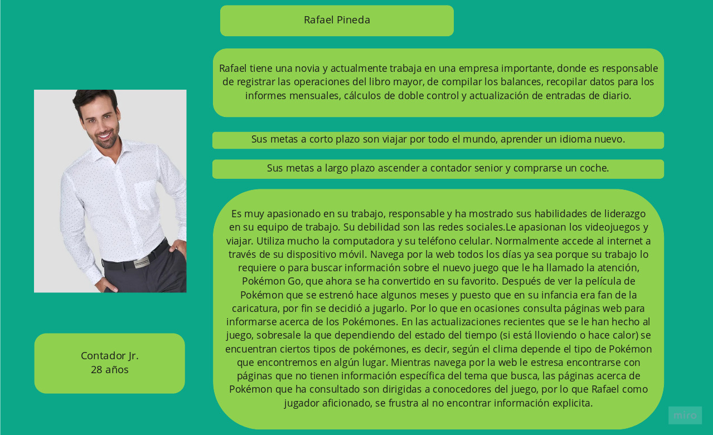

# Proyecto Pokémon

Este es el segundo reto de la 8a generación de Laboratoria. El reto consiste en diseñar una página web que permita visualizar la data de los 151 Pokémon de la región de Kanto, filtrarla, ordenarla y hacer algún cálculo agregado.

## Usuario

Tomando en cuenta que lo único que sabemos de nuestros usuarios en principio es que juegan Pokémon GO.

Decidimos elaborar y aplicar una [encuesta](https://forms.gle/w6sJvejhR46GrrDy7) para obtener más información tal como edad, sexo, ocupación y sus necesidades para más adelante poder tomar decisiones de diseño de la página web. La encuesta se aplicó en grupos de Facebook relacionados a Pokémon, así como a personas conocidas que juegan Pokémon GO.

Hasta el momento hemos tenido 32 respuestas, que arrojan los siguientes datos sobre los usuarios.

El principal rango de edad de usuarios tiene entre 25 y 30 años (34.4%), seguidos por el grupo de entre 30 y 35 años (21.9%) y el de 18 a 25 años (18.8%)

En el caso del género,los usuarios son de ambos sexos, aunque son principalmente hombres (65.6%).

También encontramos que se trata principalmente de personas que trabajan.

Notamos que en gran parte se consideran a si mismos como personas muy familiarizadas con Pokémon

Les consultamos a los usuarios acerca de que características de los Pokémon consideran las más importantes y las menos importantes para poder elegir cuales mostraremos en la interfaz.

Por último también les consultamos sobre cuales características les serían útiles como criterios para filtrar y ordenar Pokémon.

Con la información obtenida construimos nuestro "user persona".
-
### USER PERSONA

Teniendo en cuenta sus necesidades como usuario, hemos decidido crear una página web, donde se muestre la información necesaria pero sencilla para los jugadores novatos o simples aficionados, información que puedan entender y que puedan utilizar mientras juegan.

De acuerdo con una encuesta entre aficionados al juego, lo que ellos más desean ver en una página sólo son ciertas características de los pokémon, como el nombre, imagen de Pokémon y su tipo. Poderlos ver filtrados según su tipo(elemento) y la probabilidad de encontrarlos en algún lugar. Ordenados por nombre y número. Que la página les muestre información importante pero fácil de digerir.

Con estos datos elaboramos un primer [prototipo](https://marvelapp.com/9327c7g/screen/58721616)

## Testeo con usuarios del primer prototipo de baja fidelidad

Los comentarios mas recurrentes que recibimos respecto a este primer prototipo por parte de los usuarios fueron principalmente sobre dos cosas:
1. El botón de instrucciones no era claro y por su posición (colocado a la derecha) la gente asumía que era el boton para pasar a la siguiente pantalla.
2. Las opciones para ordenar estaban colocadas a la par de las de filtrar, y por ello los usuarios se confundían sobre su función. No les pareció intuitivo.

Con base en estos comentarios, decidimos hacer que los íconos fueran más descriptivos y cambiar su ubicación.
También decidimos presentar las alternativas para ordenar después de desplegar la información de los pokemon.

### Historias de usuario

1. Rafael, como usuario quiere poder entrar a la aplicación web fácilmente y filtrar todos los pokémon de tipo fuego en un sólo paso para poder comparar el pokémon que acaba de capturar con otros de su mismo tipo.
Definición de terminado: El usuario puede entrar a la web app y podrá mediante la selección en una lista desplegable, filtrar los pokemón por tipo. La historia de usuario se considerará terminada cuando pase los test.

2. Rafael, como usuario quiere poder ordenar los pokémon por orden alfabético para encontrar más fácilmente el pokémon que busca.
Definición de terminado: El usuario podrá ordenar los pokemón mediante su selección en una lista desplegable, ya sea en orden alfabético o por número del pokemon, en orden ascendente y descendente. La historia de usuario se considerará terminada cuando pase los test.

3. Rafael quiere poder ordenar los pokémon tipo planta y ordenar ese grupo en orden alfabético de forma sencilla, para poder encontrar más fácilmente un pokémon.
Definición de terminado: El usuario podra filtrar un tipo de pokemón y a su vez ordenar ese subgrupo filtrado por orden alfabético o numérico.

4. Rafael, como usuario, quiere saber que tipo de pokemón es más raro para poder decidir cuales son los siguientes que quiere capturar.
Definición de terminado: El usuario podrá ver una estadística que le muestre que porcentaje de pokémon de la región de kanto tiene cada tipo de pokémon. Se considerará terminado cuando la interfaz muestre lo porcentajes de tipo de pokémon y pase los test.

