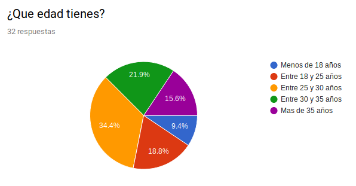
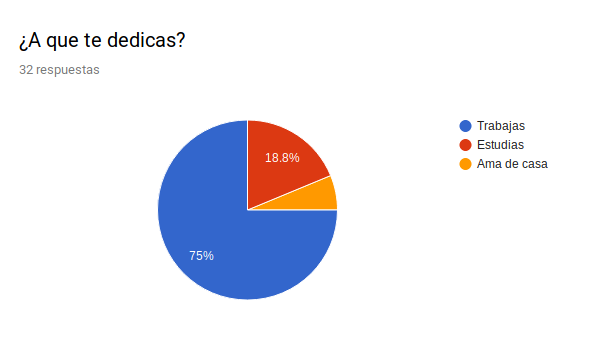
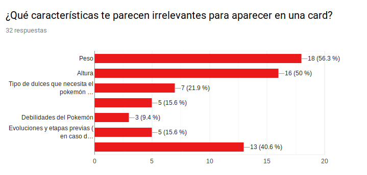

# Proyecto Pokémon

Este es el segundo reto de la 8a generación de Laboratoria. El reto consiste en diseñar una página web que permita visualizar la data de los 150 Pokémon de la región de Kanto, filtrarla, ordenarla y hacer algún cálculo agregado.

## Usuario

Tomando en cuenta que lo único que sabemos de nuestros usuarios en principio es que juegan Pokémon GO. Decidimos elaborar y aplicar una [encuesta](https://forms.gle/w6sJvejhR46GrrDy7) para obtener más información tal como edad, sexo, ocupación y sus necesidades para más adelante poder tomar decisiones de diseño de la página web. La encuesta se aplicó en grupos de Facebook relacionados a Pokémon, así como a personas conocidas que juegan Pokémon GO.

Hasta el momento hemos tenido 32 respuestas, que arrojan los siguientes datos sobre los usuarios.

El principal rango de edad de usuarios tiene entre 25 y 30 años (34.4%), seguidos por el grupo de entre 30 y 35 años (21.9%) y el de 18 a 25 años (18.8%)

En el caso del género,los usuarios son de ambos sexos, aunque son principalmente hombres (65.6%).

También encontramos que se trata principalmente de personas que trabajan.

Notamos que en gran parte se consideran a si mismos como personas muy familiarizadas con Pokémon

Les consultamos a los usuarios acerca de que características de los Pokémon consideran las más importantes y las menos importantes para poder elegir cuales mostraremos en la interfaz.

Por último también les consultamos sobre cuales características les serían útiles como criterios para filtrar y ordenar Pokémon.

Con estos datos elaboramos un primer [prototipo](https://marvelapp.com/9327c7g/screen/58721616) en Marvel, del cual aún no tenemos retroalimentación.
